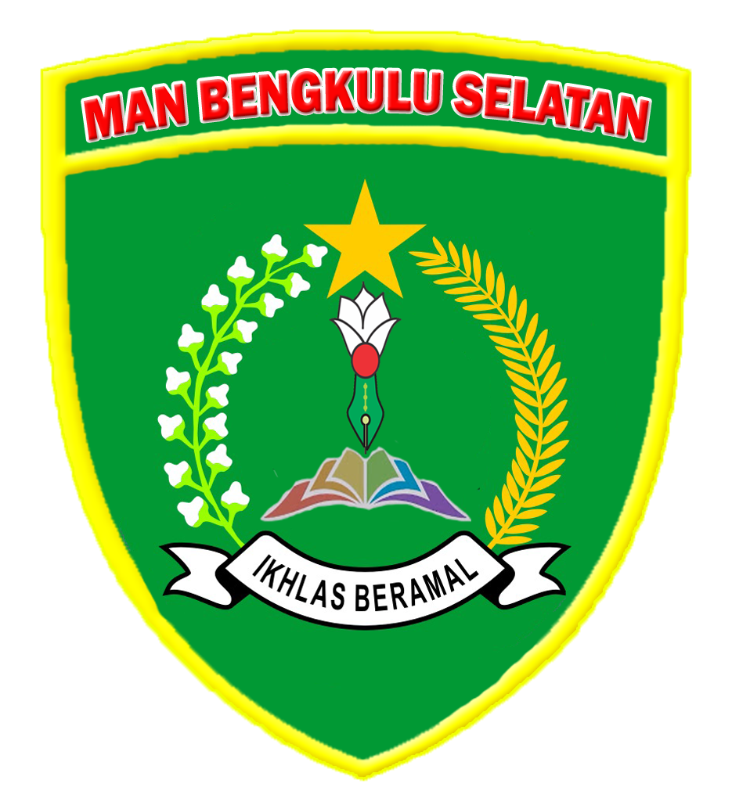

# 🎓 MAN Bengkulu Selatan - E-Learning & Sistem Informasi

<p align="center">
  
</p>

<p align="center">
  <strong>Platform E-Learning Modern & Sistem Informasi Sekolah Terintegrasi AI</strong>
</p>

<p align="center">
  
  
  
  
</p>

---

## 📋 Daftar Isi

- [Tentang Project](#-tentang-project)
- [Fitur Unggulan](#-fitur-unggulan)
- [Modul Ujian (CBT)](#-modul-ujian-cbt--anti-cheat)
- [Tech Stack](#-tech-stack)
- [Instalasi](#-instalasi)
- [Panduan Penggunaan](#-panduan-penggunaan)
- [Kontribusi](#-kontribusi)

---

## 🎯 Tentang Project

**MAN Bengkulu Selatan E-Learning** adalah solusi digital komprehensif yang menggabungkan sistem manajemen pembelajaran (LMS), ujian online berbasis komputer (CBT), dan portal informasi sekolah.

Dirancang dengan antarmuka **Glassmorphism** modern bernuansa Emerald/Green yang elegan, sistem ini tidak hanya fungsional tetapi juga memberikan pengalaman pengguna yang premium. Dilengkapi dengan **AI Chatbot (BINU)** untuk layanan informasi 24/7.

---

## ✨ Fitur Unggulan

### 🛡️ Modul Ujian (CBT) & Anti-Cheat
Sistem ujian online canggih dengan proteksi keamanan berlapis untuk menjamin integritas ujian.
- **Strict Fullscreen Mode**: Mewajibkan mode layar penuh selama ujian.
- **Focus Detection**: Mendeteksi jika siswa berpindah tab, membuka aplikasi lain, atau mengklik notifikasi (Overlay Detection).
- **Auto-Termination**: Ujian otomatis dihentikan jika terdeteksi kecurangan (keluar fullscreen/pindah tab).
- **Real-time Monitoring**: Guru dapat memantau status siswa (Online/Offline/Violation) secara real-time.
- **Automatic Grading**: Penilaian otomatis untuk soal pilihan ganda.

### 🏫 Manajemen Kelas & Akademik
- **Kelas Virtual**: Ruang belajar digital untuk materi dan diskusi.
- **Manajemen Tugas**: Distribusi dan pengumpulan tugas terpusat.
- **Absensi Digital**: Rekapitulasi kehadiran siswa yang mudah.
- **Bank Soal**: Manajemen bank soal yang dapat digunakan kembali.

### 🤖 AI Chatbot (BINU)
Asisten virtual cerdas yang siap membantu siswa dan pengunjung website.
- Terintegrasi dengan **DeepSeek AI**.
- Menjawab pertanyaan seputar sekolah, jadwal, dan PPDB.
- Respons cepat dan natural dalam Bahasa Indonesia.

### 🌐 Portal Informasi Publik
- Berita & Pengumuman Sekolah.
- Galeri Kegiatan (Foto/Video).
- Profil Guru & Tenaga Kependidikan.
- Kalender Akademik Interaktif.

---

## 🛠️ Tech Stack

### Backend
- **Framework**: Laravel 12.x
- **Language**: PHP 8.2+
- **Database**: SQLite (Development) / MySQL (Production)
- **Features**: Queues, Jobs, Cache, Eloquent ORM

### Frontend
- **Framework**: Tailwind CSS 4.x (Utility-first CSS)
- **Design System**: Emerald Glassmorphism Theme
- **Interactivity**: Alpine.js 3.x
- **Icons**: Heroicons & Lucide

### Security & Optimization
- **Protection**: CSRF Protection, XSS Sanitization, Rate Limiting
- **Anti-Cheat**: JavaScript Page Visibility API & Fullscreen API
- **Assets**: Vite Bundling, WebP Image Optimization

---

## 🚀 Instalasi

Ikuti langkah berikut untuk menjalankan project di lingkungan lokal Anda.

### Prasyarat
- PHP 8.2 atau lebih baru
- Composer
- Node.js & NPM

### Langkah-langkah

1. **Clone Repository**
   ```bash
   git clone https://github.com/username/man-bengkulu-selatan-elearning.git
   cd man-bengkulu-selatan-elearning
   ```

2. **Install Depedencies**
   ```bash
   # Backend
   composer install
   
   # Frontend
   npm install
   ```

3. **Konfigurasi Environment**
   ```bash
   cp .env.example .env
   php artisan key:generate
   ```
   *Edit file `.env` dan sesuaikan konfigurasi database Anda.*

4. **Setup Database**
   ```bash
   php artisan migrate --seed
   ```

5. **Jalankan Aplikasi**
   ```bash
   # Terminal 1: Laravel Server
   php artisan serve

   # Terminal 2: Vite Development
   npm run dev
   ```

   Akses aplikasi di: `http://localhost:8000`

---

## 📖 Panduan Penggunaan

### Login Credentials (Default Seeder)

| Role | Email | Password |
|------|-------|----------|
| **Admin** | admin@manbs.sch.id | password |
| **Guru** | guru@manbs.sch.id | password |
| **Siswa** | siswa@manbs.sch.id | password |

### Alur Ujian (Untuk Siswa)
1. Login ke dashboard siswa.
2. Masuk ke menu **Ujian Sekolah**.
3. Pilih ujian yang aktif.
4. Klik **Mulai Kerjakan** (Wajib Fullscreen).
5. Kerjakan soal tanpa meninggalkan halaman ujian.
6. Klik **Selesaikan Ujian** untuk mengirim jawaban.

### Alur Pembuatan Ujian (Untuk Guru)
1. Login ke dashboard guru.
2. Masuk ke menu **Kelola Ujian**.
3. Klik **Buat Ujian Baru**, isi detail (Waktu, Judul).
4. Tambahkan soal-soal dan kunci jawaban.
5. Gunakan tombol **Monitor** saat ujian berlangsung untuk melihat aktivitas siswa realtime.

---

## 👨‍💻 Pengembang

Dikembangkan dengan dedikasi untuk **MAN Bengkulu Selatan**.

---

<p align="center">
  <em>© 2024 - 2025 MAN Bengkulu Selatan. All Rights Reserved.</em>
</p>
